<picture>
  <source media="(prefers-color-scheme: dark)" srcset="dark_mode.svg" />
  <source media="(prefers-color-scheme: light)" srcset="light_mode.svg" />
  
</picture>

  

<picture>
  <source media="(prefers-color-scheme: dark)" srcset="dist/snake-dark.svg" />
  <source media="(prefers-color-scheme: light)" srcset="dist/snake.svg" />
  
</picture>

